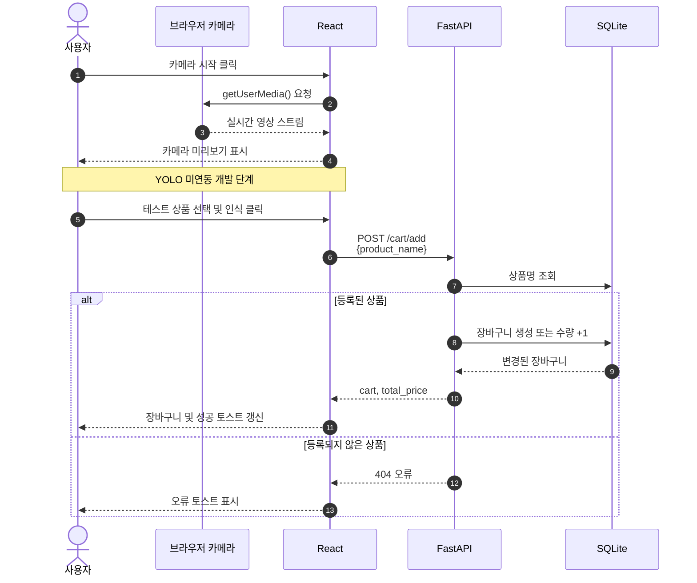
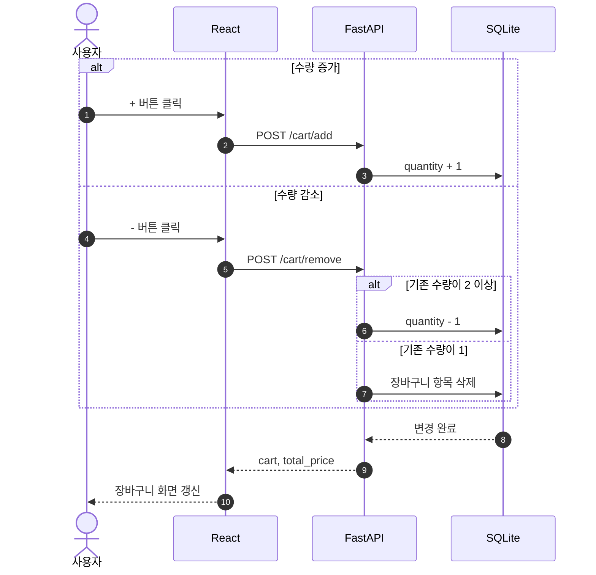
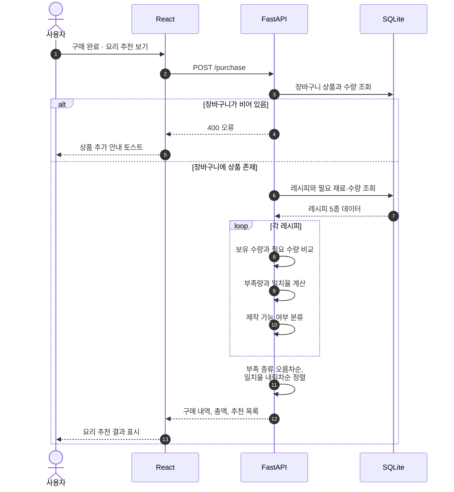
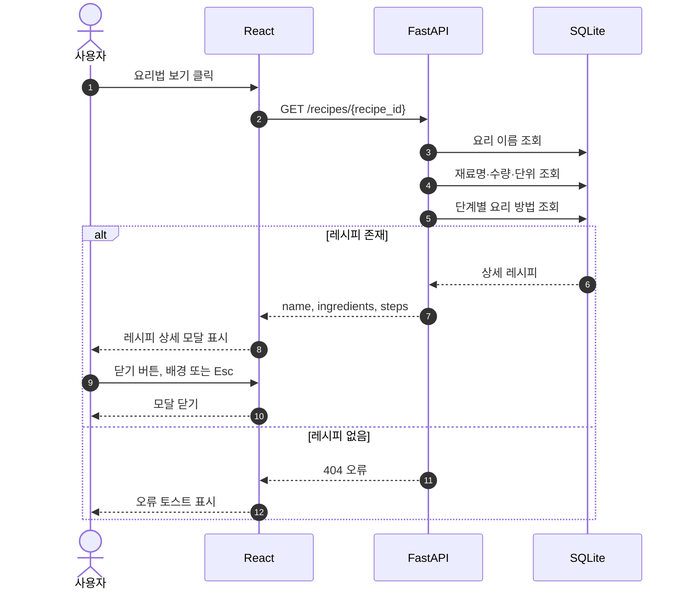
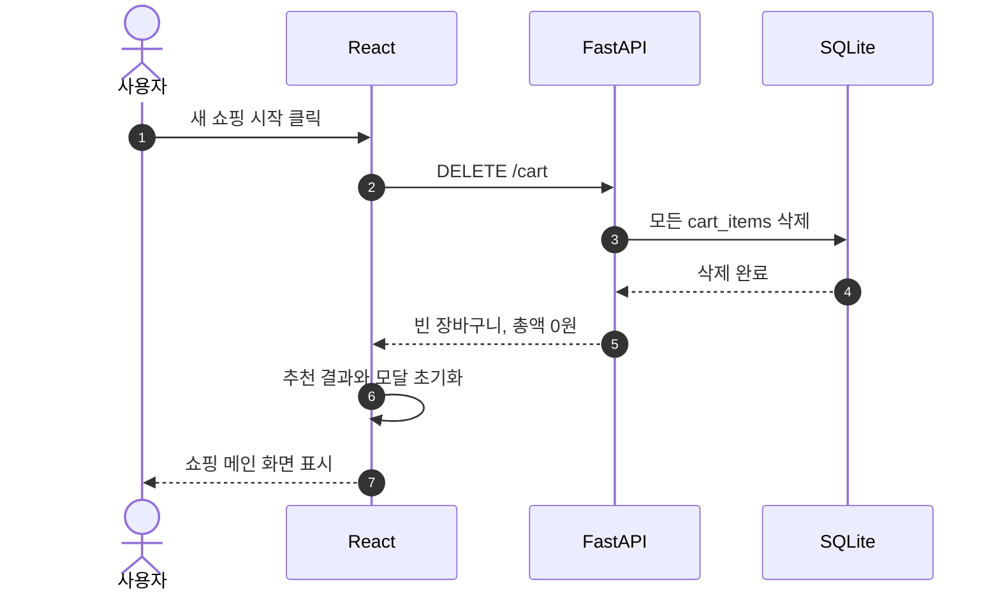
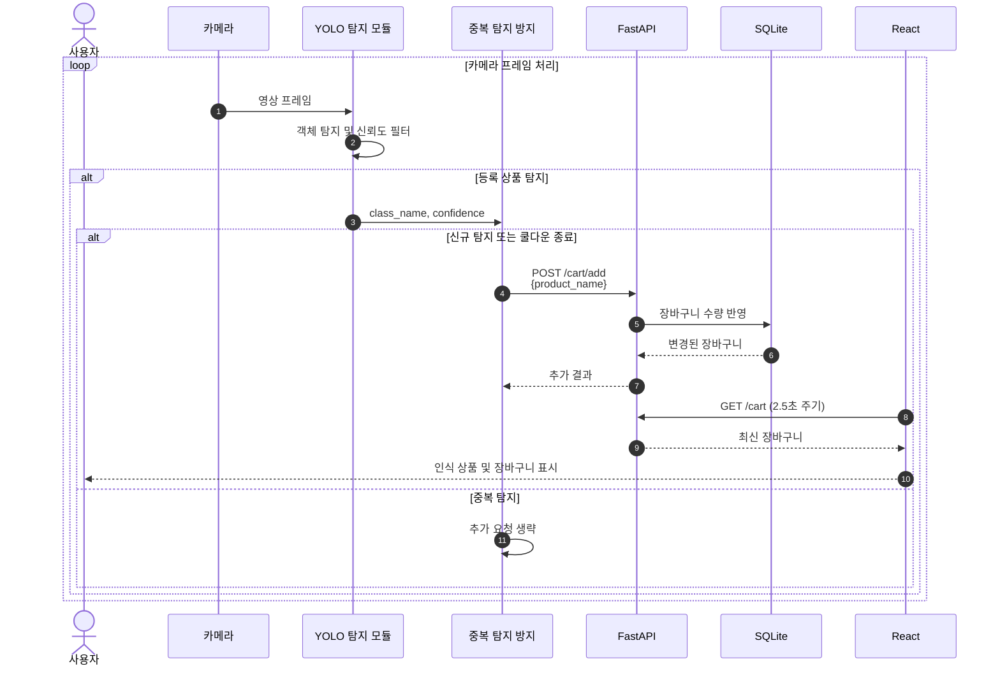
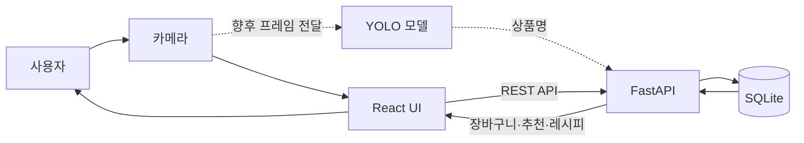

# 시퀀스 다이어그램

다이어그램은 Mermaid를 지원하는 Markdown 뷰어에서 렌더링할 수 있습니다.

## 1. 현재 개발용 상품 인식 및 장바구니 추가

## 2. 장바구니 수량 변경

## 3. 구매 완료 및 요리 추천

## 4. 상세 요리법 조회

## 5. 새 쇼핑 시작

## 6. 향후 YOLO 연결 흐름

아래 흐름은 모델 학습 완료 후 구현할 예정입니다.

## 7. 시스템 구성 관계

