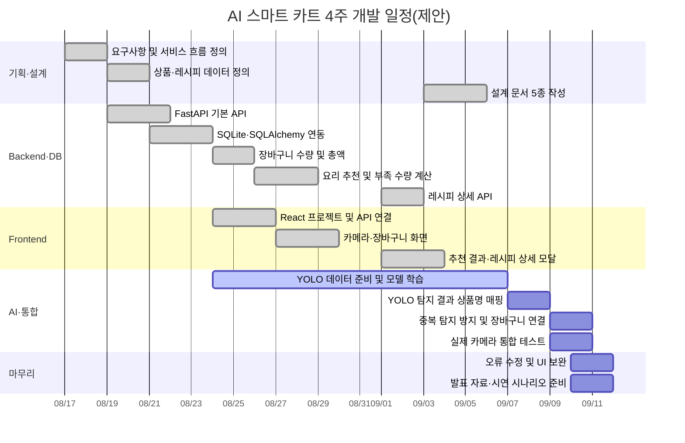

# 간트차트

## 1. 일정 기준

- 전체 기간: 4주 기준의 미니 프로젝트 제안 일정
- 예시 기간: 2026-08-17 ~ 2026-09-11
- 문서 작성 기준일: 2026-09-05
- 실제 팀 일정이 다르면 시작일과 종료일을 조정한다.
- `완료`는 현재 코드에서 구현 및 테스트된 기능이다.
- YOLO 모델 학습은 담당 팀원의 일정에 따라 변경될 수 있다.

## 2. 주차별 간트차트

| 작업 | 담당 영역 | 1주차 | 2주차 | 3주차 | 4주차 | 상태 |
|---|---|:---:|:---:|:---:|:---:|---|
| 요구사항 및 서비스 흐름 정의 | 공통 | ███ |  |  |  | 완료 |
| 상품·레시피 데이터 정의 | Backend | ███ |  |  |  | 완료 |
| FastAPI 기본 API | Backend | ███ |  |  |  | 완료 |
| SQLite·SQLAlchemy 연동 | Backend | ███ | █ |  |  | 완료 |
| 장바구니 수량·총액 처리 | Backend |  | ███ |  |  | 완료 |
| 요리 추천 및 부족량 계산 | Backend |  | ███ |  |  | 완료 |
| React 카메라·장바구니 화면 | Frontend |  | ███ | █ |  | 완료 |
| 추천 결과 화면 | Frontend |  |  | ██ |  | 완료 |
| 레시피 수량·요리법 DB | Backend |  |  | ██ |  | 완료 |
| 레시피 상세 모달 | Frontend |  |  | ██ |  | 완료 |
| 설계 문서 5종 작성 | 공통 |  |  | ██ |  | 완료 |
| YOLO 모델 학습 | AI |  | █ | ███ | █ | 진행 중/예정 |
| YOLO와 상품 API 연결 | AI·Backend |  |  |  | ██ | 예정 |
| 중복 탐지 방지 | AI·Backend |  |  |  | ██ | 예정 |
| 통합·카메라 환경 테스트 | 공통 |  |  |  | ██ | 예정 |
| 발표 자료 및 시연 시나리오 | 공통 |  |  |  | ██ | 예정 |

## 3. Mermaid 간트차트

## 4. 마일스톤

| 마일스톤 | 완료 조건 | 상태 |
|---|---|---|
| M1. Backend MVP | 상품 추가, 장바구니 조회, 총액 계산 | 완료 |
| M2. DB 전환 | 상품·레시피·장바구니가 SQLite에 저장됨 | 완료 |
| M3. 추천 기능 | 필요 재료 종류와 수량을 비교하여 추천함 | 완료 |
| M4. React UI | 카메라, 장바구니, 추천 화면이 API와 연결됨 | 완료 |
| M5. 상세 레시피 | 요리 이름, 수량 포함 재료, 조리 단계 표시 | 완료 |
| M6. YOLO 연동 | 실제 탐지 결과가 중복 없이 장바구니에 추가됨 | 예정 |
| M7. 시연 준비 | 전체 흐름 테스트와 발표 시나리오 완료 | 예정 |

## 5. 남은 작업 우선순위

1. YOLO 모델 파일과 최종 클래스 이름을 전달받는다.
2. YOLO 클래스와 DB 상품명의 매핑표를 확정한다.
3. 카메라 프레임을 탐지 모듈에 전달한다.
4. 신뢰도 기준과 동일 상품 쿨다운을 적용한다.
5. 실제 상품 10종으로 오탐·미탐 및 수량 증가를 확인한다.
6. 전체 구매·추천·레시피 흐름을 시연 환경에서 테스트한다.
7. 발표 자료와 실패 상황 대응 시나리오를 준비한다.

## 6. 최종 테스트 체크리스트

- [ ] 카메라가 시연 장치에서 정상적으로 열린다.
- [ ] 10개 상품의 YOLO 클래스명이 DB 상품명과 일치한다.
- [ ] 같은 상품이 한 번의 노출로 여러 개 추가되지 않는다.
- [ ] 상품을 다시 넣었을 때 수량이 정확히 증가한다.
- [ ] 잘못 추가된 상품을 `−` 버튼으로 제거할 수 있다.
- [ ] 서버 재시작 후 DB 데이터가 유지된다.
- [ ] 상품 가격과 총 구매금액이 정확하다.
- [ ] 필요 수량이 부족한 요리가 완성 가능으로 표시되지 않는다.
- [ ] 부족한 재료와 수량이 정확하게 표시된다.
- [ ] 모든 추천 카드에서 상세 요리법이 열린다.
- [ ] 새 쇼핑 시작 시 장바구니와 추천 상태가 초기화된다.
- [ ] FastAPI 또는 카메라 오류가 사용자에게 안내된다.
